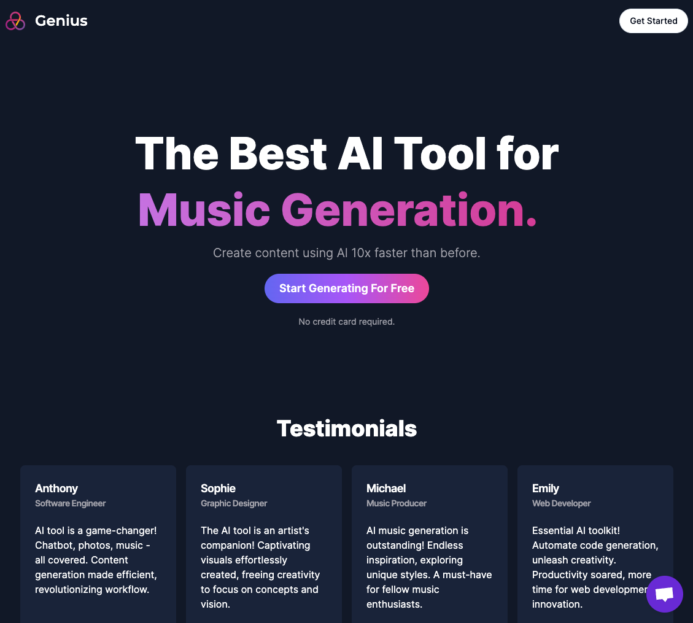
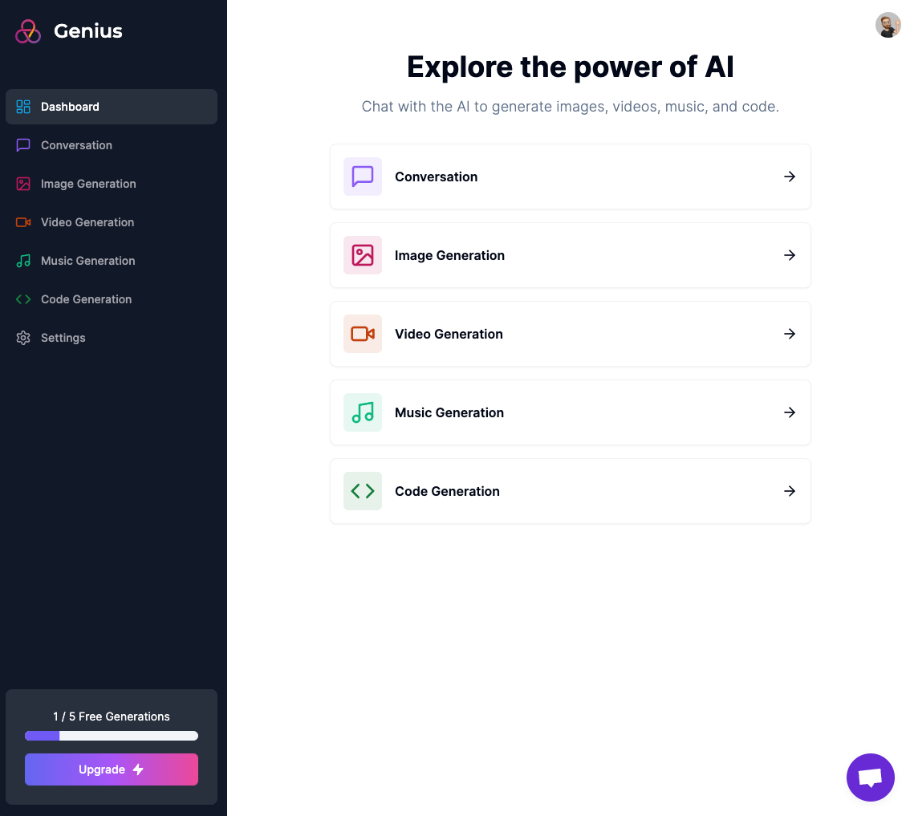

# AI SaaS Platform - Next.js Powered AI Tools

### The Live link can be found here -> [AI SaaS](https://nextjs-saas-ai-platform.vercel.app/)

The AI SaaS Platform is an innovative web application that brings together five powerful AI tools to help you create content faster and more efficiently.

Powered by Next.js 13 App Router, Stripe, Clerk, Shadcn, and Tailwind CSS, this platform harnesses the capabilities of cutting-edge AI models from Open AI and Replicate AI.

## AI Tools Included

1. **Conversation AI API (Open AI)** - Engage in natural language conversations with AI models to get instant responses and generate realistic text.
2. **Code Generation AI (Open AI)** - Automatically generate code snippets, saving valuable development time and effort.
3. **Image Generation AI (Open AI)** - Create stunning, AI-generated images for various purposes, such as art, design, and more.
4. **Music Generation AI (Replicate AI)** - Compose original music with the help of AI models, catering to different genres and moods.
5. **Video Generation AI (Replicate AI)** - Generate compelling videos and animations using AI-powered content creation.

## The Best AI Tool for Content Creators

With our AI SaaS Platform, you can supercharge your content creation process, making it up to 10 times faster than traditional methods. Whether you're a developer seeking efficient code generation or an artist looking to produce captivating visuals and melodies, this platform is tailored to meet your creative needs.

## Customer Support with Cripschat Live Chat

We take pride in providing top-notch customer support. For real-time assistance and queries, our AI SaaS Platform is equipped with Cripschat Live Chat integration. Our support team is available round-the-clock to address your concerns and ensure a seamless experience.

## Tech Stack

The AI SaaS Platform utilizes the following technologies and libraries:

- Next.js - v13.4.12
- Stripe - v12.14.0
- Clerk - v4.23.0
- Shadcn - v1.0.0 (or newer)
- Tailwind CSS - v3.3.3
- TypeScript - v5.1.6

## Dependencies

Here are some of the key dependencies used in the project:

- `@hookform/resolvers`: Form validation resolvers for React Hook Form.
- `@prisma/client`: Prisma client for database interactions.
- `axios`: HTTP client for making API requests.
- `lucide-react`: Library for adding custom icons using Lucide icons.
- `openai`: Open AI API client for integrating conversation and code generation AI.
- `replicate`: Replicate AI API client for image and music generation.
- `zustand`: State management library for handling application state.

---

Thank you for checking out my project! Happy coding! 🚀
